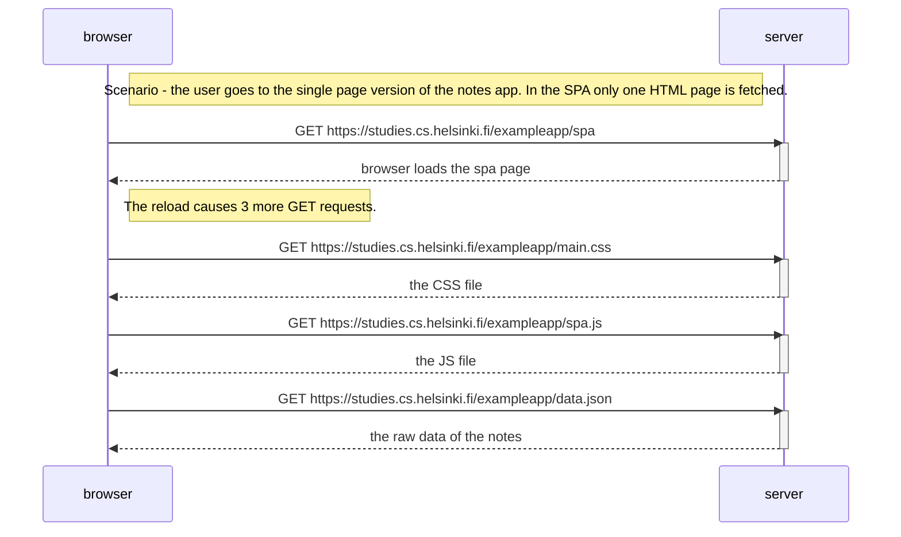

```mermaid
sequenceDiagram
    participant browser
    participant server

    Note right of browser: Scenario - the user goes to the single page version of the notes app. In the SPA only one HTML page is fetched.

    browser->>server: GET https://studies.cs.helsinki.fi/exampleapp/spa
    activate server
    server-->>browser: browser loads the spa page 
    deactivate server

    Note right of browser: The reload causes 3 more GET requests.
    
    browser->>server: GET https://studies.cs.helsinki.fi/exampleapp/main.css
    activate server
    server-->>browser: the CSS file
    deactivate server

    browser->>server: GET https://studies.cs.helsinki.fi/exampleapp/spa.js
    activate server
    server-->>browser: the JS file
    deactivate server

    browser->>server: GET https://studies.cs.helsinki.fi/exampleapp/data.json
    activate server
    server-->>browser: the raw data of the notes
    deactivate server
```
