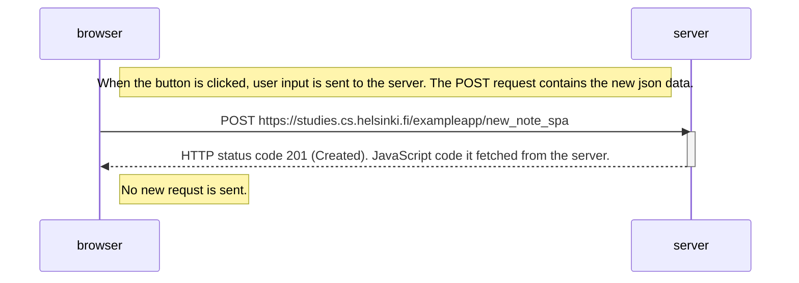

```mermaid
sequenceDiagram
    participant browser
    participant server

    Note right of browser: When the button is clicked, user input is sent to the server. The POST request contains the new json data.
    browser->>server: POST https://studies.cs.helsinki.fi/exampleapp/new_note_spa
    activate server
    server-->>browser: HTTP status code 201 (Created). JavaScript code it fetched from the server.
    deactivate server
    Note right of browser: No new requst is sent.
```
